# Delivery Task Breakdown - URL Shortener

| Field                 | Value                                            |
| --------------------- | ------------------------------------------------ |
| Document ID           | WBS-URLS-001                                     |
| Version/status        | 3.3 / Draft checkable execution backlog          |
| Last updated          | 2026-08-25                                       |
| Planning baseline     | `docs/SDLC_PLANNING_BASELINE.md` 0.7 Preliminary |
| Requirements baseline | `docs/SRS.md` 0.7 Draft — Requirements Gate Passed (Conditional) |
| Design baseline       | `docs/SYSTEM_DESIGN.md` 0.7 Draft / NOT READY    |
| Technology baseline   | `docs/TECH_STACK.md` 0.5 Proposed                |

## Revision history

| Version | Date       | Change                                                                 | Approval/status                             |
| ------- | ---------- | ---------------------------------------------------------------------- | ------------------------------------------- |
| 0.1     | 2026-08-21 | Initial dependency-ordered task breakdown                              | Draft                                       |
| 0.2     | 2026-08-21 | Added editable Markdown checkboxes to every decision and delivery task | Formatting change; task readiness unchanged |
| 0.3     | 2026-08-22 | Checked off DEC-001 and DEC-002 per signed decision records `docs/decisions/DEC-001.md` and `docs/decisions/DEC-002.md` | Confirmed by user; DEC-003 through DEC-012 remain Ready/Conditional |
| 0.4     | 2026-08-22 | Checked off DEC-004 through DEC-012 per signed decision records `docs/decisions/DEC-004.md` through `DEC-012.md` | Confirmed by user; DEC-003 remains unsigned/open (Ready); DEC-012 policy question closed but POC-001 evidence still outstanding |
| 0.5     | 2026-08-22 | Checked off DEC-003 per signed decision record `docs/decisions/DEC-003.md` | Confirmed by user; all twelve DEC/OI items now closed; targets remain unmeasured pending POC-005/load-test evidence |
| 0.6     | 2026-08-22 | Checked off T1-01 per `docs/research/T1-01-creator-api-client-findings.md` | Single-informant (solo maintainer) self-report; reopen if a real external Creator/API-client user diverges |
| 0.7     | 2026-08-22 | Checked off T1-02 per `docs/research/T1-02-business-baseline-outcomes.md`; fixed stale G-001-G-008 status cells in `docs/SRS.md` missed during the DEC-003 propagation pass | Owner satisfied by construction (solo maintainer); launch date relative (D7 still open) |
| 0.8     | 2026-08-22 | Checked off T1-03 per `docs/research/T1-03-workload-profile.md`; updated M1 Discovery blocker note | Explicit provisional profile, not evidence-backed; DR-010 measured-evidence bar still unmet |
| 0.9     | 2026-08-22 | Checked off T1-04 (`docs/research/T1-04-external-dependency-inventory.md`) and T1-05 (`docs/GOVERNANCE.md`); checked off M1 Discovery | T1-04 based on user-confirmed real account state (domain/SCM/IdP not provisioned, AWS account exists); M1 closed with provisional-workload/single-owner caveats carried forward |
| 1.0     | 2026-08-22 | Checked off T2-01 through T2-08 and M2 Requirements gate: `docs/ACCEPTANCE_CRITERIA.md`, `docs/DATA_CLASSIFICATION.md`, `docs/QUALITY_THRESHOLDS.md`, `docs/TRACEABILITY_REVIEW.md`, `docs/gates/M2-requirements-gate-review.md`, SDLC re-estimate | Confirmed by user; M2 passed conditionally, not unconditionally approved — legal review, POC evidence, and independent review all still outstanding |
| 1.1     | 2026-08-22 | Checked off T3-01 through T3-08: first real code in this repository (Go + DynamoDB Local + Valkey, local-only per user scope decision), `docs/poc/POC-001-results.md` through `POC-005-results.md`, `docs/THREAT_MODEL.md`, `docs/COST_MODEL.md`, `docs/ADR_RECONCILIATION.md` | Confirmed by user; POC-005 partial (AZ/PITR/queue/rollback need real AWS); threat model found privileged-plane gap G1; ADR-011 Go-version discrepancy needs a decision |
| 1.2     | 2026-08-22 | Checked off T4-01 through T4-06 and M3 gate: real running UI-006 prototype (`internal/webui/`), live browser usability walkthrough, fresh contrast re-verification, accessibility test matrix, API docs with real captured examples, `docs/gates/M3-architecture-ux-gate-review.md` | Confirmed by user; PASS with 6 named conditions (privileged plane unbuilt, ADR-011 unresolved, a11y scripts unrun, 9 ADRs still Deferred, 365B-row feasibility open, no legal review) |
| 1.3     | 2026-08-22 | Checked off T5-01: four deployment-unit commands scaffolded (`docs/SCAFFOLD_BOUNDARIES.md`); split `internal/api.Handlers` into `CreateHandler`/`ResolveHandler` to enforce ARC-002/ARC-003 dependency boundaries in the type system, not just docs | Confirmed by user; cmd/creation+redirect real and E2E-verified against live DynamoDB Local/Valkey; cmd/admin+worker remain honest scaffolds |
| 1.4     | 2026-08-22 | Checked off T5-02: OpenTofu bootstrap/environments/modules scaffold (`docs/poc/T5-02-opentofu-state.md`); `validate`/`plan` verified for real against the live AWS account (414987372853), zero resources created | Confirmed by user; write-only scope — apply/destroy deliberately not run, no AWS resources exist from this task |
| 1.5     | 2026-08-22 | Checked off T5-03: GitHub Actions OIDC provider/role (`docs/poc/T5-03-github-oidc.md`) with trust scoped to `repo:NoIr143/url-shortener:environment:dev`; `terraform-plan.yml` workflow, `actionlint`-clean | Confirmed by user; write-only scope — no AWS resources created, no GitHub Environment configured, workflow references vars that don't exist until applied |
| 1.6     | 2026-08-22 | Checked off T5-04: minimal non-root images for all four deployment units, ECR OpenTofu module (`docs/poc/T5-04-images-ecr.md`); real Trivy scans (0 CRITICAL/HIGH, all four images), real digest push + cosign sign/verify (positive and negative control) against a local registry, `image-scan.yml` CI gate, `actionlint`-clean | Confirmed by user; write-only scope for AWS — no ECR repository created; signing/push demonstrated against a local registry substitute, not real ECR |
| 1.7     | 2026-08-22 | Checked off T5-05: three-AZ VPC, public/internal ALB, and ECS/Fargate baseline OpenTofu modules (`docs/poc/T5-05-vpc-alb-ecs.md`); fixed a real `cmd/admin` bind-address incompatibility with the internal-ALB network topology; `validate`-verified, `tofu plan` blocked on the same known backend chicken-and-egg as T5-02/03/04 | Confirmed by user; write-only scope — no VPC/NAT/ALB/ECS resources created; no DynamoDB/ElastiCache provisioning exists in any current task (flagged, not fixed here) |
| 1.8     | 2026-08-22 | Checked off T5-06: Route 53/ACM/CloudFront/WAF edge OpenTofu module (`docs/poc/T5-06-edge-cloudfront-waf.md`); asked the user before proceeding (no domain ever registered/chosen per T1-04) and made `domain_name` a required variable with no default rather than assuming one; caching disabled at the edge to protect DEC-008's 60s propagation target; WAF managed rule groups start COUNT-only pending false-positive evidence | Confirmed by user; write-only scope — no Route 53/ACM/CloudFront/WAF resources created; case-preservation verified by configuration inspection only, not a live end-to-end test (requires apply) |
| 1.9     | 2026-08-22 | Checked off T5-07: three KMS keys, one empty Secrets Manager secret, real least-privilege DynamoDB task-role policies for creation/redirect (grounded in actual Go code call sites, `dynamodb:CreateTable` deliberately excluded), an image-signing CI OIDC role, and CloudTrail/GuardDuty/Security Hub (`docs/poc/T5-07-kms-secrets-taskroles-audit.md`) | Confirmed by user; write-only scope — no AWS resources created; least-privilege reviewed by construction, no live negative-access test (requires apply); AWS Config deliberately deferred; admin/worker task roles remain empty (no code to ground permissions in yet) |
| 2.0     | 2026-08-22 | Checked off T5-08: full local Compose stack (all four services + DynamoDB Local/Valkey) built and run for real; found and fixed two real bugs (`cmd/creation`/`cmd/redirect` always using fake DynamoDB credentials, `cmd/redirect` calling `EnsureTables` against its own least-privilege policy); added real test-table teardown (`t.Cleanup`); wrote (write-only) an ephemeral-AWS integration-testing environment/workflow (`docs/poc/T5-08-local-compose-ephemeral-aws.md`) | Confirmed by user; Compose half built/verified for real, no restrictions; ephemeral-AWS half write-only by user decision — mechanism validate-checked, never actually run; WAF/autoscaling/failover ephemeral testing deferred |
| 2.1     | 2026-08-22 | Checked off T6-01: `internal/domain` package (`Status`/`ShortKey`/`Destination`/`Mapping`, invalid/ambiguous states unrepresentable by construction) and 14 invariant tests, all passing incl. `-race` (`docs/poc/T6-01-domain-types.md`) | Confirmed by user; built and verified for real, no restrictions (application code, no AWS); two deliberate, flagged duplications with existing `internal/api` validation left for T6-02/T6-03 to resolve; `govulncheck` not run (not installed) |
| 2.2     | 2026-08-22 | Checked off T6-02: `domain.NewDestination` extended to DEC-007's full profile (closing T6-01's flagged gap); `internal/api.ValidateDestination`/`ValidateShortKey` now delegate to domain instead of duplicating rules, preserving exact error-sentinel identity for `internal/webui`'s message switch; added the missing limit-1 (2047-char) boundary case; live UI verification of all four error messages (`docs/poc/T6-02-destination-validation.md`) | Confirmed by user; built and verified for real, no restrictions; full pre-existing test suite (incl. the 26-case attack corpus) passes unchanged, `-race` clean |
| 2.3     | 2026-08-22 | Checked off T6-03: `internal/application` creation use case + `MappingRepository`/`KeyGenerator` ports (FR-004 to FR-008), 5 fake-based unit tests (success/repeat/conflict/unknown-repository/unknown-key-generator) plus one real-infrastructure integration test against DynamoDB Local; added `mapping.ErrDigestCollision` sentinel (`docs/poc/T6-03-creation-use-case.md`) | Confirmed by user; built and verified for real, no restrictions; found T6-04/T17-02 are the still-pending tasks that wire this into internal/api/internal/webui, so both were deliberately left untouched; `-race` clean |
| 2.4     | 2026-08-22 | Checked off T6-04: `internal/api.CreateHandler` rewired onto `application.CreationUseCase` (RFC 9457 mapping incl. new COMMIT_CONFLICT class); real production adapters wired into cmd/creation and cmd/server; 3 new contract tests close a real pre-existing gap (200/repeat, 503/unavailable, 503/conflict had never been tested at the handler level); live-verified against both cmd/server and cmd/creation+real DynamoDB Local (`docs/poc/T6-04-json-creation-handler.md`) | Confirmed by user; built and verified for real, no restrictions; caught and fixed a stale-background-process verification mistake mid-task; internal/webui deliberately untouched (T17-02's job); `-race` clean |
| 2.5     | 2026-08-22 | Checked off T7-01: found `internal/base62`'s encoder/parser already complete from T3-01, closed the gap between that and this task's own title — added an exhaustive 62-character alphabet bijection test, an exhaustive 256-byte invalid-character rejection test, and this repository's first fuzz test (7.3M real executions in 15s, zero failures) (`docs/poc/T7-01-base62-exhaustive-property-tests.md`) | Confirmed by user; built and verified for real, no restrictions; `-race` clean |
| 2.6     | 2026-08-22 | Checked off T7-02: found `internal/keyalloc`'s allocator already complete from T3-01; added real DynamoDB Local integration tests for the two named scenarios it lacked (restart, expiry); found and documented a real DATA-003-vs-implementation gap (no owner/expiry/status fields exist) and made a reasoned decision not to build a reclaim mechanism, given confirmed project scale (365B mappings against a 3.52T capacity) (`docs/poc/T7-02-lease-restart-expiry-tests.md`) | Confirmed by user; built and verified for real, no restrictions; `-race` clean |
| 2.7     | 2026-08-22 | Checked off T7-03: found and fixed a real bug — `internal/mapping.Repository.Create`'s cancellation handling never actually inspected which TransactWriteItems condition failed, so a genuine short-key collision could be misdiagnosed as a claim conflict; added `ErrKeyCollision` plus a bounded application-layer retry-with-fresh-key; found and fixed a second real bug (`cmd/server`'s in-memory store silently overwrote on a key collision); verified end-to-end through the real running `cmd/creation` binary against real DynamoDB Local with a genuinely poisoned key (`docs/poc/T7-03-mapping-collision-guard.md`) | Confirmed by user; built and verified for real, no restrictions; `-race` clean |
| 2.8     | 2026-08-22 | Checked off T8-01: found `internal/api.ValidateShortKey` was already consolidated onto `internal/domain` since T6-02 (no gap); added an exhaustive 26-letter case-preservation test and a client-edge-case corpus; verified case preservation live through a real Chrome browser against real `cmd/redirect` + DynamoDB Local; **found a real, unfixed bug**: unknown short keys currently return 503 instead of the confirmed 404 (`cache.RedirectCache`'s not-found signaling doesn't match `api.Resolver`'s contract) — explicitly left for T8-02, which owns redirect status outcomes (`docs/poc/T8-01-short-key-parser.md`) | Confirmed by user; built and verified for real, no restrictions; `-race` clean; T8-02 should prioritize the flagged 503-vs-404 bug |
| 2.9     | 2026-08-22 | Checked off T8-02: added `mapping.Repository.GetWithStatus` (found `Get` silently discarded stored status entirely — nothing could previously distinguish Active from Suspended); new `application.ResolveUseCase` with a closed outcome set (Active/Unknown/Suspended, corrupt status fails closed), 5 unit tests + 1 real-DynamoDB integration test proving all three outcomes against genuinely stored records incl. a directly-seeded Suspended row; found T9-02's own evidence bar substantially already met by existing code (`docs/poc/T8-02-repository-only-redirect-resolver.md`) | Confirmed by user; built and verified for real, no restrictions; `-race` clean; **T8-01's 503-vs-404 bug remains unfixed in production** until T8-03 wires this use case into cmd/redirect/internal/api |
| 3.0     | 2026-08-22 | Checked off T8-03: **fixed the T8-01/T8-02-flagged 503-vs-404 bug for real** — `internal/api.ResolveHandler` and `cmd/redirect` rewired onto `application.ResolveUseCase`; added `Cache-Control: no-store`/`X-Content-Type-Options: nosniff` on every response; live-verified all four outcomes (302/404/410/503) against the real running `cmd/creation`+`cmd/redirect`+DynamoDB Local, incl. a genuine forced Suspended state; Valkey cache-aside deliberately unwired pending T9-06 (`docs/poc/T8-03-redirect-handler-security-headers.md`) | Confirmed by user; built and verified for real, no restrictions; `-race` clean; full docker-compose 7-service stack re-verified after the compose file change |
| 3.1     | 2026-08-22 | Checked off T8-04: new `internal/application/vertical_slice_integration_test.go` proves FR-007/008/023 through the same real DynamoDB tables shared by independent `CreationUseCase`/`ResolveUseCase` instances — create-then-resolve exact-match, a `recordingKeyGenerator`-based proof that an exact-repeat's discarded candidate key was requested but never committed and resolves Unknown (FR-008), and a simulated-restart persistence check (FR-023); fresh live HTTP sign-off against the real running `cmd/creation`+`cmd/redirect`+DynamoDB Local (201 create, 200 exact-repeat, 302 resolve with correct `Location`, 404 for a syntactically valid unassigned key) (`docs/poc/T8-04-vertical-slice-e2e.md`) | Confirmed by user; built and verified for real, no restrictions; full repo `-tags=integration -race` suite (incl. `internal/cache` against real Valkey) and full non-integration `-race` suite both clean; T9-02's evidence bar remains substantively met by existing code per T8-02's finding, not re-litigated here, and T9-02 itself stays unchecked pending T9-01 |
| 3.2     | 2026-08-22 | Checked off T9-01: new `docs/DYNAMODB_TABLE_CONTRACTS.md` — recorded the as-built DynamoDB contract for the three already-implemented tables (`mapping`, `destination_claim`, `id_lease_counter`) directly from `internal/mapping/repository.go`/`internal/keyalloc/allocator.go`, flagging two real divergences from `docs/SYSTEM_DESIGN.md` §5.2/5.3's earlier, more elaborate description (no `collision_ordinal` on the claim table — genuine digest collisions fail closed via `ErrDigestCollision` instead; single-global-counter lease table with no per-lease owner/expiry, restating T7-02's already-flagged gap); designed (not implemented) the two remaining contracts (`outbox_event`, `lifecycle_audit`/`abuse_case`) for `T9-04`/`T10-03`/`T10-04` to build against, including proposed GSIs for every named access pattern and a TTL-vs-DEC-004-retention analysis per table | Confirmed by user; pure documentation task, no production code changed — no PR opened (this task's entire deliverable lives in the gitignored `docs/` tree; nothing git-trackable resulted) |
| 3.3     | 2026-08-25 | Re-audited T9-01 on implementation request: corrected mapping/claim reads from “strongly consistent” to the eventually consistent behavior actually implemented; made outbox `(aggregate,version,type)` uniqueness and sharded sparse-backlog indexing concrete; fixed the abuse-case TTL contradiction; added missing evidence-reference and future retention/scale gates; verified DynamoDB limits/consistency/TTL statements against current AWS documentation | T9-01 remains complete as a reviewed contract task; T9-04/T10-03 retain explicit pre-implementation parameters and the wider project remains governed by its architecture readiness gate |

## 1. How to use this backlog

This breakdown decomposes planning work packages W1-W17 into assignable tasks. It does not authorize production implementation while the SRS and design gates fail.

Task state meanings:

- **Ready:** documentation, decision preparation, or isolated POC work permitted by the current baselines.
- **Blocked:** do not implement until the named gate or decision passes.
- **Conditional:** may begin only within the stated containment; output is evidence, not production code.
- **Deferred:** outside MVP or triggered later.

Checkbox convention:

- Every decision and delivery task begins with `- [ ]`.
- Change it to `- [x]` only after its dependency, gate, and Evidence / done condition are satisfied.
- A checkbox records completion; the State column records whether the task is currently eligible to start. Do not check a blocked task merely because preparatory work occurred.
- When reopening a task after failed evidence or an invalidated decision, change it back to `- [ ]` and record the reason in the project change/decision log.

Indicative size is for iteration planning, not a replacement for the package estimates in the planning baseline:

When the Owner cell lists multiple roles, the first role is Accountable and the remaining roles are Responsible; named people and allocation still require DEC-001.

| Size |   Indicative effort |
| ---- | ------------------: |
| XS   | Up to 2 person-days |
| S    |     3-5 person-days |
| M    |    6-10 person-days |
| L    |   11-20 person-days |

The controlling project envelope remains **134-246 person-weeks over 27-49 elapsed weeks**. Re-estimate after M2 requirements approval, M3 POCs, named staffing, and vendor cost evidence.

## 2. Gates and dependency flow

```mermaid
flowchart LR
    M1["M1 Discovery exit"] --> M2["M2 Requirements baseline"]
    M2 --> M3["M3 Architecture + UX gate"]
    M3 --> M4["M4 Platform ready"]
    M4 --> M5["M5 Vertical slice"]
    M5 --> M6["M6 Feature complete"]
    M6 --> M7["M7 Quality gate"]
    M7 --> M8["M8 Scale / resilience gate"]
    M8 --> M9["M9 Launch gate"]
    M9 --> M10["M10 General availability"]
```

| Gate                       | Required evidence                                                                                | Accountable       | Current state         |
| -------------------------- | ------------------------------------------------------------------------------------------------ | ----------------- | --------------------- |
| - [x] M1 Discovery         | Sponsor/owners, users/outcome, initial workload and decision log                                 | Product Lead      | All of T1-01 through T1-05 done; owners/users/outcome and decision log real, workload profile explicitly provisional (T1-03), single-informant throughout |
| - [x] M2 Requirements      | Reviewed SRS, OI-001-OI-005 resolved, public/API/UI contracts and acceptance targets             | Product Lead      | PASS with named conditions — see `docs/gates/M2-requirements-gate-review.md`; not an unconditional approval (no legal review, no POC evidence, single reviewer) |
| - [x] M3 Architecture + UX | ADR review, POC-001-005 evidence, cost model, threat model, UI-006 prototype/usability direction | Architecture Lead | PASS with named conditions — see `docs/gates/M3-architecture-ux-gate-review.md`; privileged plane unbuilt, ADR-011 Go version unresolved, a11y scripts unrun |
| - [ ] M4 Platform          | Reproducible dev/test/stage, protected CI/CD, IaC and security controls                          | SRE Lead          | Blocked by M3         |
| - [ ] M5 Vertical slice    | UI/API create -> committed mapping -> redirect, with core invariant tests                        | Engineering Lead  | Blocked by M3/M4      |
| - [ ] M6 Feature complete  | Cache, events, abuse/admin, observability, recovery, UI states complete in staging               | Engineering Lead  | Blocked by M5         |
| - [ ] M7 Quality           | Requirements-linked functional, browser, accessibility, security and recovery evidence           | QA Lead           | Blocked by M6         |
| - [ ] M8 Scale/resilience  | Load, soak, fault, failover, restore and penetration evidence                                    | QA Lead           | Blocked by M7         |
| - [ ] M9 Launch            | UAT, accepted residual risk, operations readiness and rollback rehearsal                         | Product Lead      | Blocked by M8         |
| - [ ] M10 GA               | Controlled production rollout, observation, training and ownership handoff                       | SRE Lead          | Blocked by M9         |

## 3. Decision backlog - complete before production build

| Task          | Decision/output                                                                                                   | Owner                | Dependency          | Size | Evidence / done condition                                           | State       |
| ------------- | ----------------------------------------------------------------------------------------------------------------- | -------------------- | ------------------- | ---: | ------------------------------------------------------------------- | ----------- |
| - [x] DEC-001 | Name Sponsor, Product, Engineering, SRE, QA, Security and Privacy owners; confirm target users and funded outcome | Sponsor/Product      | None                |    S | Signed decision record closes OI-001 — see `docs/decisions/DEC-001.md` | Done       |
| - [x] DEC-002 | Select 301 or 302 and decide whether click analytics enters MVP                                                   | Product              | DEC-001             |    S | Decision closes OI-002; analytics addition includes planning impact — see `docs/decisions/DEC-002.md` | Done       |
| - [x] DEC-003 | Approve latency, availability, workload mix, peak factor, failure classes, RTO/RPO, regions and rollback target   | SRE/Product          | DEC-001             |    M | Measurable SLO/recovery decision closes OI-003 — see `docs/decisions/DEC-003.md`; targets unmeasured, POC-005/load-test evidence still required | Done       |
| - [x] DEC-004 | Approve retention, deletion, residency, encryption, backups, disposal and applicable obligations                  | Privacy/Product      | DEC-001             |    M | Data-policy decision closes OI-004 — see `docs/decisions/DEC-004.md` | Done       |
| - [x] DEC-005 | Approve anonymous/authenticated creation, quota dimensions, abuse/takedown/appeal and emergency access policy     | Product/Security     | DEC-001             |    L | Threat/policy record closes OI-005 — see `docs/decisions/DEC-005.md` | Done       |
| - [x] DEC-006 | Approve exact-repeat equality, idempotency and concurrent duplicate outcome                                       | Product              | DEC-002/005         |    S | Decision closes OI-006 and selects/retire destination claim — see `docs/decisions/DEC-006.md` | Done       |
| - [x] DEC-007 | Approve destination validation profile and maximum encoded length                                                 | Product/Security     | DEC-005             |    M | Corpus and limits close OI-007 — see `docs/decisions/DEC-007.md` | Done       |
| - [x] DEC-008 | Approve maximum suspension/reinstatement propagation time                                                         | Security/SRE         | DEC-003/005          |    S | Safety bound closes OI-008 — see `docs/decisions/DEC-008.md`; DEC-003 now signed, both dependencies resolved | Done       |
| - [x] DEC-009 | Approve API/UI routes, schemas, error, compatibility, timeout and retry contracts                                 | Product/Engineering  | DEC-002/005/006/007 |    M | Reviewed OpenAPI/UI contract closes OI-009 — see `docs/decisions/DEC-009.md` | Done       |
| - [x] DEC-010 | Approve browser/proxy/CDN/viewport matrix and case-preservation test set                                          | Product/QA           | DEC-009             |    M | Compatibility matrix closes OI-010 — see `docs/decisions/DEC-010.md` | Done       |
| - [x] DEC-011 | Approve UI accessibility level, default language and localization set                                             | Product/UX/QA        | DEC-001/010         |    S | UI acceptance profile closes OI-011; WCAG 2.2 AA confirmed — see `docs/decisions/DEC-011.md` | Done       |
| - [x] DEC-012 | Decide whether numeric IDs + Base62 are mandatory or whether another unique-key strategy is allowed               | Product/Architecture | POC-001 (not executed) |    S | Decision closes OI-012 (mandatory) — see `docs/decisions/DEC-012.md`; ADR-002 acceptance still awaits POC-001 evidence | Done — policy question only; POC-001 evidence outstanding |

## 4. Discovery and requirements - W1/W2

| Task        | Work item                                                                                   | Owner                | Dependency              | Size | Trace                         | Evidence / done condition                                        | State                |
| ----------- | ------------------------------------------------------------------------------------------- | -------------------- | ----------------------- | ---: | ----------------------------- | ---------------------------------------------------------------- | -------------------- |
| - [x] T1-01 | Interview/validate human Creator and API-client use cases, pain points and success criteria | Product/UX           | DEC-001                 |    M | G-001; UC-001                 | Findings, personas and ranked outcomes reviewed — see `docs/research/T1-01-creator-api-client-findings.md` | Done — single-informant (solo maintainer); reopen if a real external user diverges |
| - [x] T1-02 | Establish business baseline and measurable launch/30-day outcomes                           | Product              | DEC-001                 |    S | G-001-G-008                   | Metric, baseline, target, owner and date recorded — see `docs/research/T1-02-business-baseline-outcomes.md` | Done — launch date relative (T+0/T+30); D7 (calendar launch window) still open |
| - [x] T1-03 | Validate workload distribution, URL lengths, hot keys, geography and peak assumptions       | Product/SRE/Data     | DEC-001                 |    L | NFR-PERF/CAP; DR-010          | Evidence-backed load profile or explicit provisional profile — see `docs/research/T1-03-workload-profile.md` | Done — explicit provisional profile; DR-010 measured-evidence bar still unmet |
| - [x] T1-04 | Inventory domain, DNS/TLS, IdP, SCM, AWS accounts and external ownership                    | SRE/Security         | DEC-001                 |    M | IR-EXT-002; ARC-011           | Dependency/owner/SLA/renewal register — see `docs/research/T1-04-external-dependency-inventory.md` | Done — domain/DNS/TLS/IdP/SCM not provisioned; AWS account exists |
| - [x] T1-05 | Establish decision, risk, change and evidence repositories                                  | Product/PM           | DEC-001                 |    S | Planning governance           | Templates, owners and cadence active — see `docs/GOVERNANCE.md` | Done — event-triggered cadence; single-owner, no independent reviewer |
| - [x] T2-01 | Incorporate DEC-001-012 outcomes into SRS without renumbering IDs                           | Product/BA           | DEC tasks               |    M | SRS Section 12                | SRS updated; superseded assumptions identified — see `docs/SRS.md` Section 12 "Superseded assumptions" | Done |
| - [x] T2-02 | Finalize UI-006 and API functional acceptance criteria                                      | Product/UX/QA        | DEC-006/007/009-011     |    M | FR-001-008/025-029; IR-UI-001 | Normal, invalid, retry, concurrency and failure evidence defined — see `docs/ACCEPTANCE_CRITERIA.md` Part A | Done |
| - [x] T2-03 | Finalize redirect, abuse/admin and operations contracts                                     | Product/Security/SRE | DEC-002/003/005/008/009 |    L | FR-009-024; IR-API/ADM/OPS    | Every response/action/recovery path verifiable — see `docs/ACCEPTANCE_CRITERIA.md` Part B | Done |
| - [x] T2-04 | Finalize data lifecycle, privacy classification and audit requirements                      | Privacy/Data         | DEC-004/005             |    M | DR-001-010; NFR-PRIV          | Approved classification/lifecycle/verification matrix — see `docs/DATA_CLASSIFICATION.md` | Done |
| - [x] T2-05 | Finalize quality thresholds and acceptance environments                                     | QA/SRE               | DEC-003/010/011         |    M | All NFR IDs                   | Measurable workload, threshold, method and evidence owner — see `docs/QUALITY_THRESHOLDS.md` | Done |
| - [x] T2-06 | Run SRS consistency, feasibility and bidirectional traceability review                      | QA/Architecture      | T2-01-05                |    M | 81 requirement IDs            | Zero unexplained orphan/conflict/TBD without owner/gate — see `docs/TRACEABILITY_REVIEW.md` (6 real orphans found and fixed) | Done |
| - [x] T2-07 | Re-estimate plan for approved requirements and update risk/cost envelopes                   | Product/Architecture | T2-06                   |    M | W1-W17                        | Estimate basis and deltas reviewed — see `docs/SDLC_PLANNING_BASELINE.md` Section 1a | Done — effort range unchanged, elapsed-time uncertainty now dominated by D7 |
| - [x] T2-08 | Conduct requirements gate review and record approval or gaps                                | Product              | T2-06/07                |    S | M2                            | Named reviewers and decision record; SRS status updated honestly — see `docs/gates/M2-requirements-gate-review.md` | Done — PASS with named conditions, not unconditional approval |

## 5. Architecture, POCs and UX - W3/W4

| Task        | Work item                                                                        | Owner                    | Dependency                             | Size | Trace                              | Evidence / done condition                                          | State                     |
| ----------- | -------------------------------------------------------------------------------- | ------------------------ | -------------------------------------- | ---: | ---------------------------------- | ------------------------------------------------------------------ | ------------------------- |
| - [x] T3-01 | POC-001 key lease, fencing, split-brain, exhaustion and Base62 case behavior     | Engineering/Architecture | None; DEC-012 consumes result          |    L | ADR-002; FR-006; NFR-REL-001       | Zero duplicate committed keys; failure report and recommendation — see `docs/poc/POC-001-results.md` | Done — local-only (DynamoDB Local), 8/8 tests pass |
| - [x] T3-02 | POC-002 DynamoDB transaction, partition, repeat-claim, restore and cost model    | Data/Architecture        | DEC-006 preferred; may test both modes |    L | ADR-004/007; DR-001-010            | Threshold/cost report with pass/fallback decision — see `docs/poc/POC-002-results.md` | Done — mechanism PASS (4/4); 365B-row partition/cost NOT tested locally |
| - [x] T3-03 | POC-003 Valkey hit/miss/hot-key/failure and suspension propagation               | SRE/Engineering          | DEC-003/008 for final pass             |    L | ADR-003/013; NFR-PERF-002/SAFE-001 | Measured safety/latency evidence; fallback trigger evaluated — see `docs/poc/POC-003-results.md` | Done — 4/4 pass; 344.75µs measured invalidation latency (local only) |
| - [x] T3-04 | POC-004 edge case, path case, header/input attack and layered rate controls      | Security/QA              | DEC-005/007/010 for final pass         |    L | ADR-012; NFR-SEC/COMP              | No case corruption/injection/bypass; findings treated — see `docs/poc/POC-004-results.md` | Done — 26/26 sub-cases pass |
| - [x] T3-05 | POC-005 task/AZ loss, throttling, queue lag, rollback and PITR restore/reconcile | SRE/Data                 | DEC-003/004 for final pass             |    L | ADR-006; NFR-REL-002/MNT-002       | Timed exercise and zero unexplained mapping differences — see `docs/poc/POC-005-results.md` | Partial — backup/restore/reconcile PASS; AZ loss/PITR/queue lag/rollback NOT achievable locally (named explicitly, not fabricated) |
| - [x] T3-06 | Complete threat model and protection/control verification plan                   | Security                 | T2-03/04; POC-004                      |    L | NFR-SEC/PRIV; ARC trust zones      | Threats, treatments, owners and evidence reviewed — see `docs/THREAT_MODEL.md` | Done — 4 real gaps named (G1: privileged plane entirely untested) |
| - [x] T3-07 | Produce low/base/high AWS cost model including egress, logs, backups and support | Architecture/Finance     | POC-002/003/005                        |    M | DES-014                            | Assumptions and monthly ranges accepted or returned for change — see `docs/COST_MODEL.md` | Done — figures approximate, not live-priced; always-on ALB/Fargate cost flagged for reconsideration |
| - [x] T3-08 | Reconcile ADR-001-018 against POC/requirement evidence                           | Architecture             | T3-01-07; M2                           |    M | ADR-001-018                        | Each ADR Approved/Rejected/Superseded/Deferred with rationale — see `docs/ADR_RECONCILIATION.md` | Done — 4 Approved, 4 Approved-partial, 1 Needs decision (ADR-011 Go version), 9 Deferred |
| - [x] T4-01 | Prototype UI-006 low-fidelity flow and content                                   | Product/UX               | DEC-007/009/011                        |    M | BR-011; UI-006                     | Entry, validation, busy, result/copy and recovery prototype — see `docs/poc/T4-01-prototype.md` | Done — 6/9 states server-rendered and real, running (`internal/webui/`) |
| - [x] T4-02 | Run first-use and error-recovery usability sessions                              | Product/UX/QA            | T4-01                                  |    M | FR-025-029                         | Findings ranked; critical task failures resolved or planned — see `docs/poc/T4-02-usability-walkthrough.md` | Done — 0 defects found; keyboard-focus check inconclusive, flagged for T4-04 |
| - [x] T4-03 | Define design tokens and semantic component/state specifications                 | Product/UX               | T4-01/02                               |    M | ADR-018; NFR-INT-001               | Type/color/space/focus/error/status specs and contrast evidence — see `docs/poc/T4-03-design-tokens-verification.md` | Done — pre-existing spec, contrast re-verified fresh (44/44) |
| - [x] T4-04 | Define accessibility test matrix and manual scripts                              | QA/UX                    | DEC-010/011; T4-01                     |    M | NFR-INT-001                        | Keyboard/focus/reflow/screen-reader cases approved — see `docs/ACCESSIBILITY_TEST_MATRIX.md` | Done — matrix/scripts written; none executed yet |
| - [x] T4-05 | Draft API/developer onboarding documentation                                     | Engineering/Product      | DEC-009                                |    M | UI-001; IR-API-001/004             | Reviewed examples contain no real destinations/secrets — see `docs/API.md` | Done — all examples are real captured server output, synthetic domains only |
| - [x] T4-06 | Conduct architecture and UX gate                                                 | Architecture             | T3-08; T4-02-05                        |    S | M3                                 | Approved design/contained residual risks or documented return path — see `docs/gates/M3-architecture-ux-gate-review.md` | Done — PASS with 6 named conditions, not unconditional |

## 6. Platform and delivery foundation - W5

| Task        | Work item                                                                              | Owner           | Dependency        | Size | Trace                         | Evidence / done condition                                          | State                 |
| ----------- | -------------------------------------------------------------------------------------- | --------------- | ----------------- | ---: | ----------------------------- | ------------------------------------------------------------------ | --------------------- |
| - [x] T5-01 | Scaffold Go module, four commands, internal boundaries and web assets/templates        | Engineering     | M3                |    M | ARC-002/003/004/009/014       | Builds locally; dependency boundaries reviewed — see `docs/SCAFFOLD_BOUNDARIES.md` | Done — cmd/creation+redirect real and E2E-verified; cmd/admin+worker are honest scaffolds (Gap G1, ADR-005/014 Deferred) |
| - [x] T5-02 | Create OpenTofu root environments/modules and remote state controls                    | SRE             | M3                |    L | ADR-015                       | Reproducible dev plan/apply/destroy with protected encrypted state — see `docs/poc/T5-02-opentofu-state.md` | Done for plan (real, verified against live AWS); apply/destroy not run — write-only scope by user decision |
| - [x] T5-03 | Configure GitHub Actions OIDC roles and protected environments                         | SRE/Security    | T5-02             |    M | ADR-015; NFR-SEC-004          | No long-lived AWS key; trust limited to repo/environment/workflow — see `docs/poc/T5-03-github-oidc.md` | Done for code (validate/plan/actionlint verified); apply and GitHub Environment protection rules not configured — write-only scope by user decision |
| - [x] T5-04 | Build minimal non-root images, ECR repositories, signing/digest promotion and scanning | SRE/Engineering | T5-01/03          |    M | NFR-MNT-001/SEC-004           | Immutable digest promoted; scan gate produces evidence             | Done for images/scan/sign (real, all four units, non-root, 0 CRIT/HIGH, digest push+sign+verify against local registry) — see `docs/poc/T5-04-images-ecr.md`; ECR repository code written but not applied — write-only scope by user decision |
| - [x] T5-05 | Provision VPC/subnets/security groups, public/internal ALBs and ECS/Fargate baseline   | SRE             | T5-02             |    L | ADR-012/017                   | Multi-AZ dev/stage smoke test; admin has no public bypass          | Done for code (three-AZ VPC/ALB/ECS modules, `validate`-verified) — see `docs/poc/T5-05-vpc-alb-ecs.md`; not applied — write-only scope by user decision; multi-AZ smoke test requires apply |
| - [x] T5-06 | Provision Route 53/ACM/CloudFront/WAF baseline with case-preserving routes             | SRE/Security    | T5-05; DEC-010    |    L | ARC-001; NFR-SEC-001/COMP-001 | TLS and routing tests pass through full edge                       | Done for code (edge module, `validate`-verified; case-preservation verified by configuration inspection) — see `docs/poc/T5-06-edge-cloudfront-waf.md`; not applied — write-only scope by user decision; no domain registered, `domain_name` is a required variable with no default; live TLS/routing test requires apply |
| - [x] T5-07 | Configure KMS, Secrets Manager, task roles and audit/security services                 | Security/SRE    | T5-02/05; DEC-004 |    M | NFR-SEC/PRIV                  | Least-privilege review and negative-access tests pass              | Done for code (3 KMS keys, 1 secret, real task-role policies, CloudTrail/GuardDuty/Security Hub; `validate`-verified) — see `docs/poc/T5-07-kms-secrets-taskroles-audit.md`; not applied — write-only scope by user decision; negative-access tests require apply; AWS Config deferred |
| - [x] T5-08 | Establish local Compose and ephemeral AWS integration environments                     | Engineering/SRE | T5-01/02          |    M | TECH_STACK Section 6          | Repeatable setup/teardown; no production credential reuse          | Done for Compose (real, all 6 services, verified end-to-end incl. teardown) and for ephemeral-AWS code (IAM role/workflow, `validate`-verified) — see `docs/poc/T5-08-local-compose-ephemeral-aws.md`; ephemeral environment never applied/run — write-only scope by user decision; WAF/autoscaling/failover ephemeral testing deferred |

## 7. Core creation, key and redirect vertical slice - W6/W7/W8

| Task        | Work item                                                              | Owner                | Dependency              | Size | Trace                      | Evidence / done condition                                                      | State                    |
| ----------- | ---------------------------------------------------------------------- | -------------------- | ----------------------- | ---: | -------------------------- | ------------------------------------------------------------------------------ | ------------------------ |
| - [x] T6-01 | Implement domain Mapping/status/value types and invariant tests        | Engineering          | M3/T5-01                |    M | BR-002-004/007; DR-001-003 | Invalid/ambiguous states unrepresentable or rejected                           | Done — `internal/domain` package, 14 invariant tests pass incl. `-race` — see `docs/poc/T6-01-domain-types.md`; two deliberate, flagged duplications with `internal/api` left for T6-02/T6-03 |
| - [x] T6-02 | Implement destination validation profile and malicious/boundary corpus | Engineering/Security | DEC-007; T6-01          |    M | FR-001-003; NFR-SEC-003    | Limit-1/limit/limit+1 and malicious cases pass                                 | Done — `domain.NewDestination` full DEC-007 profile, `internal/api` delegates (error identity preserved), limit-1/limit/limit+1 all pass — see `docs/poc/T6-02-destination-validation.md` |
| - [x] T6-03 | Implement creation application use case and repository port            | Engineering          | T6-01/02; DEC-006/009   |    L | FR-004-008; ARC-002        | Success/repeat/conflict/unknown commit behavior tested                         | Done — `internal/application` use case + ports, 5 unit tests + 1 real-DynamoDB integration test, all pass — see `docs/poc/T6-03-creation-use-case.md`; internal/api/internal/webui deliberately untouched (T6-04/T17-02's job) |
| - [x] T6-04 | Implement JSON creation handler and RFC 9457 error mapping             | Engineering          | T6-03; DEC-009          |    M | INT-001; ADR-010           | Contract tests cover all response classes                                      | Done — CreateHandler rewired onto the use case, real production adapters in cmd/creation+cmd/server, all response classes contract-tested, live-verified against real DynamoDB Local — see `docs/poc/T6-04-json-creation-handler.md`; internal/webui deliberately untouched (T17-02's job) |
| - [x] T7-01 | Implement Base62 encoder/parser and exhaustive/property tests          | Engineering          | DEC-012/T3-01           |    M | ADR-002; FR-006            | Round trip, alphabet, boundary and case tests pass                             | Done — encoder/parser already complete from T3-01; added exhaustive alphabet/byte-rejection tests plus this repo's first fuzz test (7.3M execs, 0 failures) — see `docs/poc/T7-01-base62-exhaustive-property-tests.md` |
| - [x] T7-02 | Implement fenced DynamoDB range leasing and local allocator            | Engineering/Data     | T7-01; T3-01/02         |    L | ARC-006; DATA-003          | Partition/restart/expiry tests prove no duplicate committed keys               | Done — allocator already complete from T3-01; added restart/expiry integration tests against real DynamoDB Local; DATA-003 owner/expiry/status fields deliberately not implemented (reasoned decision, not oversight) — see `docs/poc/T7-02-lease-restart-expiry-tests.md` |
| - [x] T7-03 | Implement final conditional mapping collision guard                    | Engineering/Data     | T6-03/T7-02             |    M | BR-003; NFR-REL-001        | Forced collision rejected with safe retry/failure                              | Done — found and fixed a real cancellation-reason bug, added ErrKeyCollision + bounded application-layer retry, live-verified through real cmd/creation + real DynamoDB Local with a genuinely poisoned key — see `docs/poc/T7-03-mapping-collision-guard.md` |
| - [x] T8-01 | Implement exact case-sensitive short-key parser                        | Engineering          | DEC-010/012             |    S | FR-009/013; NFR-COMP-001   | Supported edge/client corpus preserves keys                                    | Done — parser already correct/consolidated (T6-02); added exhaustive case + client-edge-case tests; case preservation live-verified via real Chrome against real cmd/redirect — see `docs/poc/T8-01-short-key-parser.md` |
| - [x] T8-02 | Implement repository-only redirect resolver and safe status outcomes   | Engineering          | T6-01; T9-02            |    L | FR-009-016/021             | Active redirects exactly; invalid/unknown/suspended/unavailable never redirect | Done — `GetWithStatus` + `application.ResolveUseCase`, closed outcome set, unit + real-DynamoDB tests all pass — see `docs/poc/T8-02-repository-only-redirect-resolver.md`; T9-02's evidence bar found substantially already met by existing code |
| - [x] T8-03 | Implement redirect HTTP handler and response security headers          | Engineering/Security | T8-01/02; DEC-002/009   |    M | INT-002; NFR-SEC-003       | Exact status/Location/no-Location contract passes                              | Done — **the T8-01 503-vs-404 bug is fixed in the real running system**, live-verified (302/404/410/503 all correct, Cache-Control/X-Content-Type-Options on every response) — see `docs/poc/T8-03-redirect-handler-security-headers.md`; Valkey cache-aside deliberately unwired pending T9-06 |
| - [x] T8-04 | Complete immediate create -> resolve vertical-slice E2E                | QA/Engineering       | T6-04/T7-03/T8-03/T9-02 |    M | FR-007/008/023             | Committed result resolves; injected precommit failure exposes no key           | Done — 3 real-DynamoDB integration tests plus a fresh live HTTP-level check against `cmd/creation`+`cmd/redirect`; see `docs/poc/T8-04-vertical-slice-e2e.md` |

## 8. Data, cache and event completion - W9

| Task        | Work item                                                                    | Owner             | Dependency            | Size | Trace                     | Evidence / done condition                                                  | State                    |
| ----------- | ---------------------------------------------------------------------------- | ----------------- | --------------------- | ---: | ------------------------- | -------------------------------------------------------------------------- | ------------------------ |
| - [x] T9-01 | Define DynamoDB mapping, lease, claim, case/audit and outbox table contracts | Data/Architecture | POC-002; DEC-004/006  |    L | DATA-001-008; ADR-004/007 | Access pattern/keys/limits/cost reviewed                                   | Done — `docs/DYNAMODB_TABLE_CONTRACTS.md`: as-built contracts for mapping/claim/lease (with flagged design-doc divergences), designed contracts for outbox/audit/abuse-case |
| - [ ] T9-02 | Implement DynamoDB mapping repository with conditional writes/CAS            | Data/Engineering  | T9-01                 |    L | ARC-005; DR-001-005       | Integration/concurrency tests prove invariants                             | Blocked by T9-01         |
| - [ ] T9-03 | Implement optional destination claim and exact-byte verification             | Data/Engineering  | DEC-006; T9-02        |    L | ADR-007; DR-005           | Digest collision simulation and concurrent repeat pass; retire if rejected | Blocked by DEC-006       |
| - [ ] T9-04 | Implement transactional outbox write boundary                                | Data/Engineering  | T9-02                 |    M | ADR-005/014; DATA-005     | Mapping/status commit and outbox are atomic                                | Blocked by T9-02         |
| - [ ] T9-05 | Provision Streams/Pipes/SQS/DLQ and version-aware worker                     | Engineering/SRE   | T9-04/T5 platform     |    L | ARC-009/010; INT-008      | Duplicate/reorder/gap/DLQ/replay tests pass                                | Blocked by prerequisites |
| - [ ] T9-06 | Implement Valkey status-aware cache-aside and bounded negative caching       | Engineering/SRE   | POC-003; T8-02        |    L | ARC-007; ADR-013          | Hit/miss/stale/corrupt/unavailable cases preserve safety                   | Blocked by POC/M3 — T8-03 deliberately unwired `internal/cache.RedirectCache` from `cmd/redirect` (repository-only resolver in the meantime); this task re-adds it on top of `application.ResolveUseCase`, plus restores `VALKEY_ADDR` wiring in `docker-compose.yml`'s `redirect` service — see `docs/poc/T8-03-redirect-handler-security-headers.md` |
| - [ ] T9-07 | Implement lifecycle invalidation with state-version protection               | Engineering       | T9-05/06; DEC-008     |    M | FR-017; NFR-SAFE-001      | Measured propagation meets approved bound                                  | Blocked by DEC-008       |
| - [ ] T9-08 | Configure PITR/AWS Backup and build restore/reconciliation tooling           | Data/SRE          | DEC-003/004; T9-01/02 |    L | ARC-013; DR-009           | Restore to new table and zero unexplained differences                      | Blocked by decisions     |

## 9. Security, abuse and administration - W10

| Task         | Work item                                                          | Owner                | Dependency          | Size | Trace               | Evidence / done condition                                       | State                     |
| ------------ | ------------------------------------------------------------------ | -------------------- | ------------------- | ---: | ------------------- | --------------------------------------------------------------- | ------------------------- |
| - [ ] T10-01 | Implement application-layer creation quotas and layered WAF policy | Security/Engineering | DEC-005; T5-06      |    L | FR-014/015          | Under-limit succeeds; excess has no mapping side effect         | Blocked by DEC-005        |
| - [ ] T10-02 | Configure Identity Center/Verified Access for internal admin ALB   | Security/SRE         | DEC-005; T5-05      |    M | ADR-017; IR-ADM-001 | Positive/negative/session tests; no public bypass               | Blocked by DEC-005/M3     |
| - [ ] T10-03 | Implement abuse case repository/workflow                           | Engineering/Security | DEC-004/005; T9-01  |    L | FR-020; DR-007      | Valid/invalid/duplicate cases follow approved policy            | Blocked by decisions      |
| - [ ] T10-04 | Implement suspension/reinstatement CAS and reason capture          | Engineering/Security | T10-02/03; T9-02/04 |    L | FR-017-019          | Authorization, stale conflict, audit and propagation tests pass | Blocked by prerequisites  |
| - [ ] T10-05 | Implement immutable lifecycle audit and authorized search          | Security/Data        | DEC-004; T10-04     |    M | DR-006; NFR-SEC-002 | Complete append-only evidence for every state change            | Blocked by DEC-004        |
| - [ ] T10-06 | Implement governed break-glass procedure and evidence              | Security/SRE         | DEC-005; T10-02     |    M | DES-012; ADR-017    | Timed exercise with approval, expiry and audit                  | Blocked by DEC-005        |
| - [ ] T10-07 | Complete security code/config/IaC review and remediate findings    | Security/Engineering | T5-T10              |    L | NFR-SEC-001-004     | No unaccepted critical/high finding                             | Blocked by implementation |

## 10. Mandatory public creation UI - W17

| Task         | Work item                                                                | Owner                  | Dependency             | Size | Trace                | Evidence / done condition                                           | State                               |
| ------------ | ------------------------------------------------------------------------ | ---------------------- | ---------------------- | ---: | -------------------- | ------------------------------------------------------------------- | ----------------------------------- |
| - [ ] T17-01 | Implement semantic Go template layout and tokenized responsive CSS       | Full-stack/UX          | T4-03; T5-01           |    M | ARC-014; ADR-018     | Semantic landmarks, labels, focus and approved responsive states    | Blocked by M3/M4                    |
| - [ ] T17-02 | Implement initial form and same-origin server submission                 | Full-stack             | T6-03; DEC-009         |    M | FR-025; INT-010      | Works with JavaScript disabled; server validation authoritative     | Blocked by decisions/core use case  |
| - [ ] T17-03 | Implement retained input, linked field errors and accessible summary     | Full-stack/QA          | T6-02/T17-02           |    M | FR-026               | Invalid corpus preserves value and moves/announces focus correctly  | Blocked by T17-02                   |
| - [ ] T17-04 | Implement result link, selectable value, copy enhancement and feedback   | Full-stack/UX          | T17-02                 |    M | FR-027               | Clipboard success announced; denial/unsupported path remains usable | Blocked by T17-02                   |
| - [ ] T17-05 | Implement busy/duplicate-submit prevention and control recovery          | Full-stack             | T17-02; DEC-006/009    |    S | FR-029               | Rapid activation produces one logical request; control recovers     | Blocked by decisions                |
| - [ ] T17-06 | Implement throttle, temporary, interrupted and ambiguous recovery states | Full-stack/Engineering | T6-03; DEC-006/009     |    M | FR-028; FR-015/016   | No uncommitted key; safe input retention and retry guidance         | Blocked by decisions                |
| - [ ] T17-07 | Add CSP, contextual output encoding tests and telemetry redaction checks | Security/QA            | T17-01-06              |    M | NFR-SEC-003/PRIV-001 | Malicious corpus cannot execute; destination absent from telemetry  | Blocked by UI implementation        |
| - [ ] T17-08 | Run final UI usability and accessibility remediation cycle               | Product/UX/QA          | T17-01-07; DEC-010/011 |    L | NFR-INT-001          | Product accepts core task; no critical/serious accessibility defect | Blocked by implementation/decisions |

## 11. Observability and operations - W11/W16

| Task         | Work item                                                                                 | Owner                    | Dependency                     | Size | Trace                | Evidence / done condition                               | State                      |
| ------------ | ----------------------------------------------------------------------------------------- | ------------------------ | ------------------------------ | ---: | -------------------- | ------------------------------------------------------- | -------------------------- |
| - [ ] T11-01 | Define SLI/error-budget queries and telemetry allowlist/redaction                         | SRE/Privacy              | DEC-003/004                    |    M | NFR-OBS-001/PRIV-001 | Every approved SLO has query and prohibited-field test  | Blocked by decisions       |
| - [ ] T11-02 | Instrument Go services with OTel/ADOT metrics, logs and traces                            | Engineering/SRE          | T11-01; service implementation |    L | ADR-016; ARC-012     | Correlated RED/USE signals without destination leakage  | Blocked by implementation  |
| - [ ] T11-03 | Build dashboards for create, UI, redirect, cache, data, queue, abuse and capacity         | SRE                      | T11-02                         |    M | UI-005; NFR-OBS-001  | Critical scenarios visible with owned thresholds        | Blocked by T11-02          |
| - [ ] T11-04 | Configure actionable alerts and on-call routing                                           | SRE                      | T11-03                         |    M | FR-022               | Alert tests reach owner and link to runbook             | Blocked by T11-03          |
| - [ ] T11-05 | Write incident, cache collapse, throttle, lease, queue, certificate and rollback runbooks | SRE/Engineering          | T11-03/04                      |    L | UC-005               | Tabletop/game-day steps executable and reviewed         | Blocked by system behavior |
| - [ ] T11-06 | Write backup restore, reconcile and regional/provider outage runbooks                     | SRE/Data                 | T9-08; DEC-003/004             |    L | NFR-REL-002          | Timed exercise inputs/owners/stop criteria defined      | Blocked by decisions/T9-08 |
| - [ ] T16-01 | Define maintenance cadence for dependencies, access, capacity and recovery                | SRE/Security             | M7 evidence                    |    S | Section 9 SRS        | Owners/cadence/evidence repositories approved           | Blocked by M7              |
| - [ ] T16-02 | Define retirement triggers, notice, domain transition and data disposition                | Product/Privacy/SRE      | DEC-004; T9-08                 |    M | FR-024               | Approved rehearsal plan and reconciliation evidence     | Blocked by DEC-004         |
| - [ ] T16-03 | Define post-launch support, abuse escalation and ownership handoff                        | Product/Support/Security | DEC-005                        |    M | UC-004/005           | Rota, severity, response and escalation matrix approved | Blocked by DEC-005         |

## 12. Verification and release - W12/W13/W14/W15

| Task         | Work item                                                                  | Owner               | Dependency                 | Size | Trace                          | Evidence / done condition                                        | State                    |
| ------------ | -------------------------------------------------------------------------- | ------------------- | -------------------------- | ---: | ------------------------------ | ---------------------------------------------------------------- | ------------------------ |
| - [ ] T12-01 | Build requirements-to-test coverage matrix and release evidence index      | QA                  | M2; implementation backlog |    M | All 81 requirements            | Every in-scope requirement has test/analysis/inspection evidence | Blocked by M2            |
| - [ ] T12-02 | Execute API/UI/redirect functional and negative-path suites                | QA                  | M6                         |    L | FR-001-029                     | All approved acceptance criteria pass                            | Blocked by M6            |
| - [ ] T12-03 | Execute concurrency, retry, duplicate, ordering and reconciliation suites  | QA/Data             | M6                         |    L | FR-004/005/008/028/029; DR-009 | Zero conflicting mapping or unexplained difference               | Blocked by M6            |
| - [ ] T12-04 | Execute supported browser/viewport/proxy/CDN compatibility suite           | QA                  | DEC-010; M6                |    L | NFR-COMP-001                   | 100% approved matrix passes or exception accepted                | Blocked by DEC-010/M6    |
| - [ ] T12-05 | Execute automated and manual accessibility suite                           | QA/UX               | DEC-011; M6                |    L | NFR-INT-001                    | Approved conformance met; no critical/serious defect             | Blocked by DEC-011/M6    |
| - [ ] T12-06 | Execute privacy, telemetry canary and authorization suites                 | Security/Privacy/QA | M6                         |    L | NFR-SEC/PRIV                   | No prohibited value or authorization bypass                      | Blocked by M6            |
| - [ ] T13-01 | Run incremental create and redirect load tests to saturation               | Performance/QA      | M7; DEC-003                |    L | NFR-PERF/CAP-001/002           | Approved percentiles/errors met; saturation documented           | Blocked by M7/DEC-003    |
| - [ ] T13-02 | Run 24-hour mixed workload soak and reconciliation                         | Performance/Data    | T13-01                     |    L | NFR-CAP-003                    | No unbounded growth/corruption/severity-1/2 fault                | Blocked by T13-01        |
| - [ ] T13-03 | Run cache/store/queue/task/AZ fault-injection game days                    | SRE/QA              | M7                         |    L | NFR-AVL/SAFE                   | Safe degradation and error-budget behavior demonstrated          | Blocked by M7            |
| - [ ] T13-04 | Run timed restore, rollback and reconciliation exercise                    | SRE/Data/QA         | M7; DEC-003/004            |    L | NFR-REL-002/MNT-002            | Approved RTO/RPO/rollback met with zero mapping loss             | Blocked by decisions/M7  |
| - [ ] T13-05 | Execute penetration test and resolve/accept findings                       | Security            | M7                         |    L | NFR-SEC-004                    | Zero unaccepted critical/high findings                           | Blocked by M7            |
| - [ ] T14-01 | Deploy limited beta with synthetic and approved user traffic               | Product/SRE         | M8                         |    M | M9                             | Stop/go signals and support coverage active                      | Blocked by M8            |
| - [ ] T14-02 | Conduct Product UAT for creation UI/API, redirects and support workflow    | Product/QA          | T14-01                     |    M | G-001-G-008                    | Product acceptance record or defect backlog                      | Blocked by beta          |
| - [ ] T14-03 | Remediate beta/UAT defects and rerun affected evidence                     | Engineering/QA      | T14-02                     |    L | Affected IDs                   | No open release blocker; evidence refreshed                      | Blocked by UAT           |
| - [ ] T14-04 | Rehearse production deployment, rollback and communications                | SRE/Product         | T14-03                     |    M | NFR-MNT-002                    | Timed rehearsal and decision checklist pass                      | Blocked by remediation   |
| - [ ] T14-05 | Conduct launch readiness review and residual-risk acceptance               | Product             | T14-04; all gates          |    S | M9                             | Named approvals; exceptions have owner/expiry                    | Blocked by all evidence  |
| - [ ] T15-01 | Execute progressive production rollout with automated/manual stop criteria | SRE                 | M9                         |    M | M10                            | Each stage meets SLI/security/data checks                        | Blocked by M9            |
| - [ ] T15-02 | Complete stabilization observation window and capacity review              | SRE/Product         | T15-01                     |    M | G-001-G-008                    | Stable window accepted; incidents reconciled                     | Blocked by rollout       |
| - [ ] T15-03 | Train Support/Security/SRE and hand over runbooks/access                   | SRE/Product         | T15-01; T11/T16            |    M | UC-004/005                     | Role-based exercise and access review pass                       | Blocked by rollout       |
| - [ ] T15-04 | Close release evidence, known risks and follow-up backlog                  | QA/Product          | T15-02/03                  |    S | NFR-MNT-001                    | Traceable release record complete                                | Blocked by stabilization |

## 13. Suggested iteration sequence

No calendar dates are committed because named people and capacity are missing. With two-week iterations and the planning staffing assumption:

| Iteration band | Focus                                                                  | Parallel work                              | Exit                            |
| -------------- | ---------------------------------------------------------------------- | ------------------------------------------ | ------------------------------- |
| 1-2            | DEC-001-012, W1 discovery, requirement preparation                     | POC-001/002 setup; UI research             | M1 then M2 when decisions close |
| 3-5            | POC-001-005, threat model, ADR review, UI prototype                    | Cost model and platform design             | M3                              |
| 6-7            | IaC/CI/CD/environments and repository scaffold                         | Test harnesses                             | M4                              |
| 8-10           | Core creation/key/data/redirect plus UI functional slice               | Security controls and telemetry foundation | M5                              |
| 11-13          | Cache/events/admin/abuse/recovery/UI completion                        | Runbooks and contract coverage             | M6                              |
| 14-16          | Functional, browser, accessibility, security and recovery verification | Defect remediation                         | M7                              |
| 17-19          | Load/soak/fault/restore/penetration                                    | Cost/capacity refresh                      | M8                              |
| 20-22          | Beta, UAT, remediation and launch rehearsal                            | Training and handoff                       | M9                              |
| 23+            | Progressive launch and stabilization                                   | Maintenance/retirement readiness           | M10                             |

This sequence is illustrative. It must be recalculated from actual availability and velocity; it does not override the 27-49-week planning envelope.

## 14. Definition of ready and done

### A build task is ready only when

- its requirement IDs and acceptance criteria are reviewed;
- blocking OI/DEC items are closed;
- applicable ADR and interface/data design are reviewed;
- security/privacy/accessibility impacts and test data are known;
- dependency environments and owners are available;
- the task has one accountable owner and a demonstrable outcome.

### A task is done only when

- implementation or document output satisfies its stated evidence condition;
- normal, invalid, retry/concurrency, dependency-failure and permission paths are covered as applicable;
- relevant automated checks and required manual evidence pass;
- telemetry contains no prohibited destination/secrets;
- traceability and affected documentation are updated;
- residual risks, follow-ups and rollback implications are recorded;
- no readiness or approval claim exceeds the actual gate result.

## 15. Immediate next actions

- [x] Assign owners and complete DEC-001 first. — done 2026-08-22, see `docs/decisions/DEC-001.md`
- [x] Run DEC-002 through DEC-012 as grouped Product/SRE/Security/Privacy/UX workshops. — done 2026-08-22, see `docs/decisions/DEC-002.md` through `DEC-012.md`
- [ ] Start isolated POC-001 and POC-002 in parallel as feasibility evidence; do not treat them as production implementation.
- [ ] Prototype UI-006 and test first-use, validation, result/copy and failure recovery.
- [ ] Update the SRS and planning estimate, then conduct M2 before opening production build tasks.

**Current recommendation: CONDITIONAL GO for decisions, requirements refinement, UI prototyping and architecture POCs; NO-GO for production build tasks until M2/M3 pass.**
